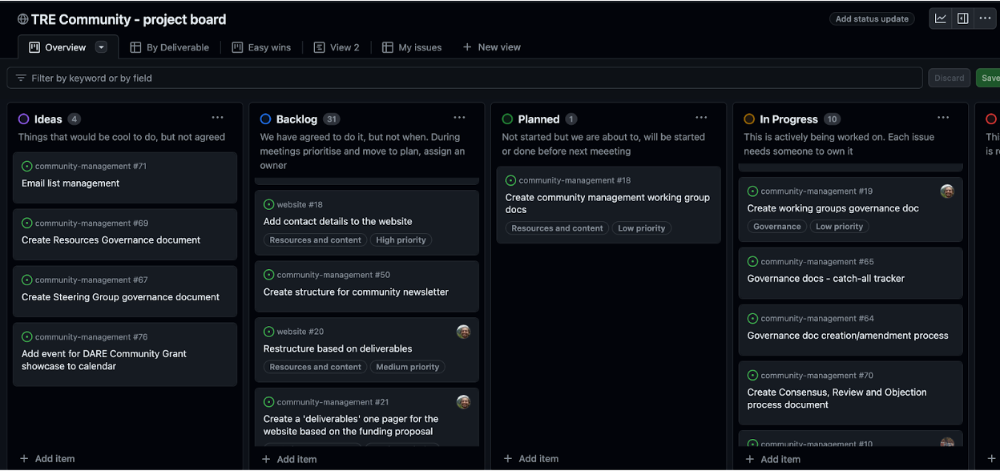
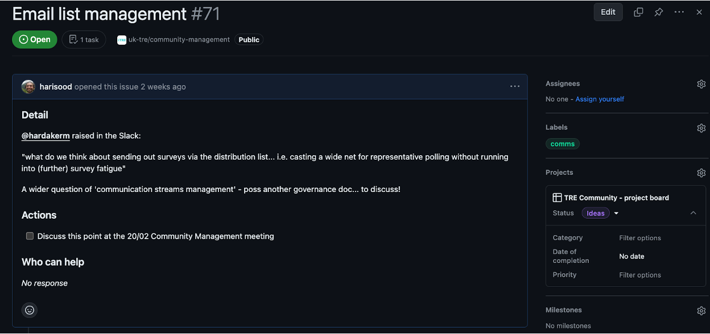
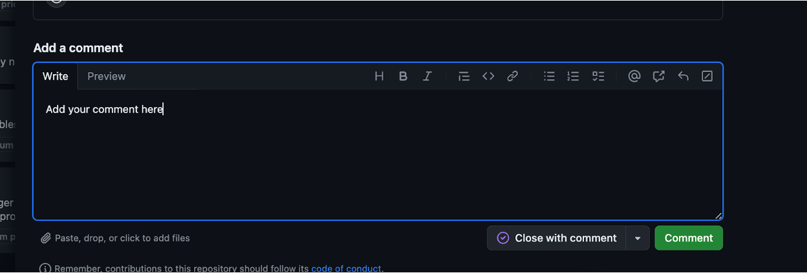
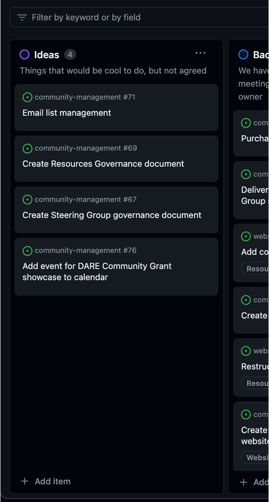
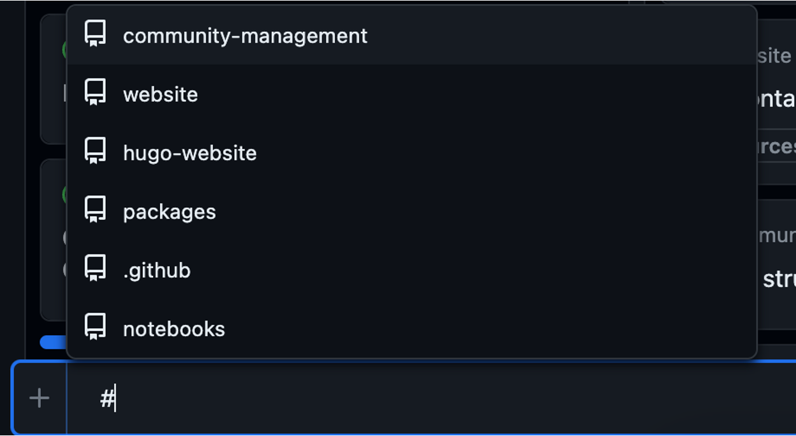
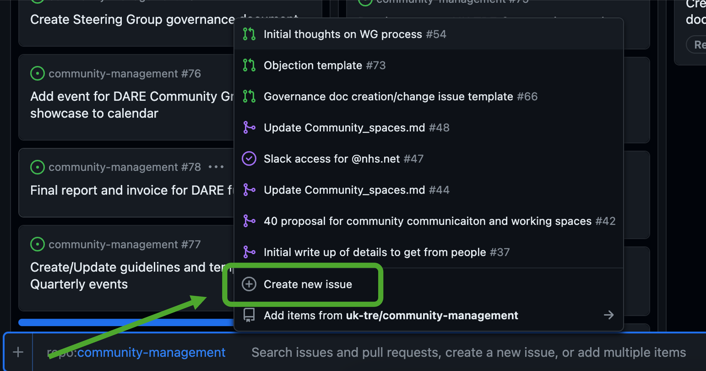
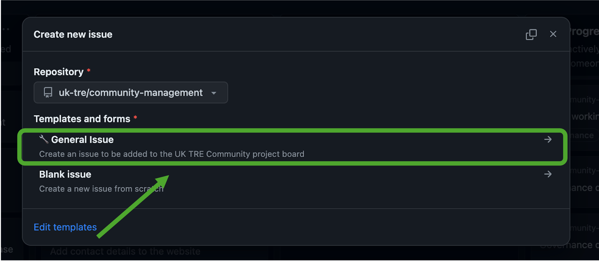
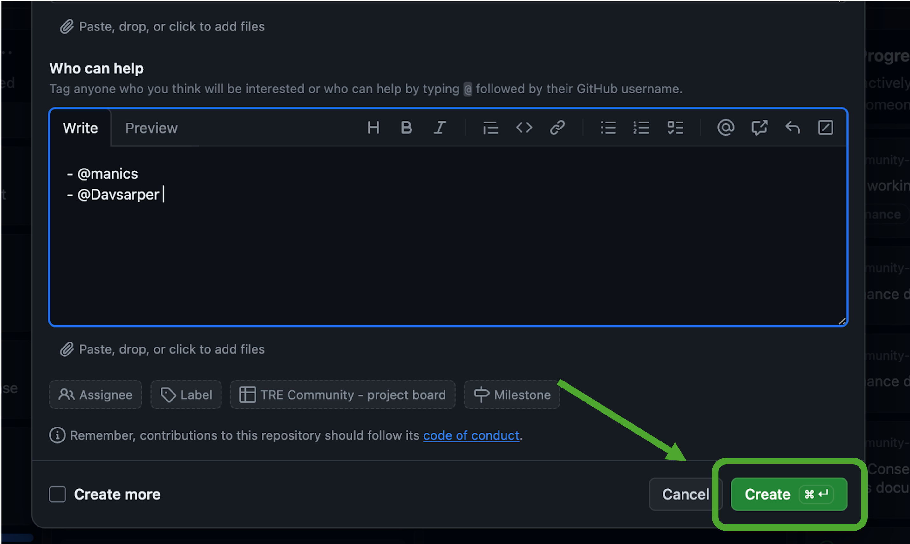
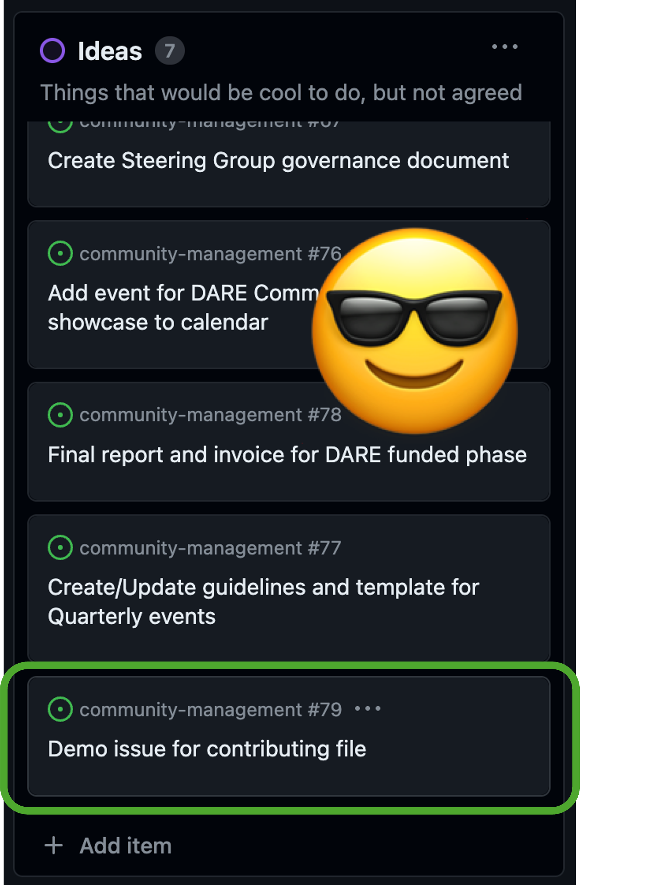

# Contributing to the Community Management repository

## Intro
Welcome to UK TRE Community Management Working Group repository! :tada:

☀️ We're excited that you're here and want to contribute. ☀️

We want to ensure that every user and contributor feels welcome, included and supported to participate in the UK TRE community. 
We hope that the information provided in this file will make it as easy as possible for you to get involved.

There are two main ways to contribute to this repo - via GitHub issues, and via Google Forms. 
Contributions primarily take the form of creating issues, adding comments and taking part in discussions.
Specific updates to content and the website are managed by the [Community Management Working Group](https://uktre.org/groups/current/community_management/). 

Please follow these guidelines to make sure your contributions can be easily integrated into the repo. 
As you start contributing to the UK TRE community, don't forget that your ideas are more important than perfectly curated issues and forms :heart:

If you have any questions that aren't discussed below, please let us know through one of the many ways to get in touch.

## :sparkles: How to contribute

:star: You are acknowledged for all kinds of contributions

Whatever is your availability, there is a way to contribute.

### :wave: I'm busy, I only have 5 minutes

We use GitHub issues on [this project board](https://github.com/orgs/uk-tre/projects/1) to track our work.

Look through the board to troubleshoot an issue or participate in an ongoing discussion by commenting.

You can also share this repository with someone who might be interested to get involved.

For more details on how to get started contributing to the project board, see ‘Contributing to our project board’ below.

### :timer: I've got 15 minutes - tell me what I should do

You can read our [README](./README.md) file to find  more details on the group, as well as details of our aims on the [Community Management Working Group page](https://uktre.org/groups/current/community_management/).

You can also read different issues in this repository and comment where you would like to be involved.

### :tada: I want to dive deeper and become part of the Working Group

Amazing! We’d love to have you involved.

The best way to be more directly involved in the Working Group is to attend our weekly meetings, Tuesdays 11:00 - 12:00.
These meetings are sprints in which we prioritise and allocate tasks within the group.

We share joining instructions for the meeting each week on the #community-management channel on our [Slack workspace](https://join.slack.com/t/uktrecommunity/shared_invite/zt-26r7jz25d-J5iV0XoqyLepEiKk4XpJVg).

Alternatively, if you’d like to get a regular recurring invite you can email David (dsarmientoperez@turing.ac.uk).

## 📧 Get in touch

There are many ways to get in touch with the Community Management team!

### GitHub issues

Join a discussion, collaborate on an ongoing task and exchange your thoughts with others.

Can't find your idea being discussed anywhere? Open a new issue! (See the contributing through GitHub guidance below).

### Slack Channel

We have a #community-management channel on the [UK TRE Community Slack workspace](https://join.slack.com/t/uktrecommunity/shared_invite/zt-26r7jz25d-J5iV0XoqyLepEiKk4XpJVg).
The Community Management Working Group will also provide notifications on upcoming events and share useful resources on Slack.

### Individual members

You can also tag any of the leads of the Community Management Working group on GitHub using their usernames below.
- @ manics
- @ davsarper
- @ harisood
- @ hardakerm

Or you can email David (dsarmientoperez@turing.ac.uk). 

## 😎 Contributing to our working group

We manage all our tasks via our [Project board](https://github.com/orgs/uk-tre/projects/1).

There are two main ways to add tasks to the project board:
- Directly via GitHub (recommended)
- Indirectly via a Google Form. The Community Management Working Group will then add your submission to the Project Board as an issue.

### Contributing directly through GitHub

Below is a walkthrough of all the steps required to contribute via GitHub, from the very beginning.

This walkthrough is designed to give you the critical path steps to contributing directly to any UK TRE community repository. 
For a broader, deeper introduction to GitHub, check out the [Turing Way’s Introduction to GitHub Workshop](https://www.youtube.com/watch?v=Vcckl-2dASM), run at [CarpentryCon2022](https://2022.carpentrycon.org/).

1. Go to the [GitHub homepage](https://github.com/)
3. In the top right corner, click either ‘Sign In’ (if you have an account already) or ‘Sign Up’. You will need an email, password, username and one or two other things.

3. Once you are logged in, navigate to our [Project board](https://github.com/orgs/uk-tre/projects/1/views/1)

4. This project board is a [Kanban board](https://www.atlassian.com/agile/kanban/boards#:~:text=Kanban%20boards%20use%20cards%2C%20columns,often%20times%20invisible%20and%20intangible.) for all ongoing tasks within the community. Each task is represented as an ‘Issue’ card on the board. The board is split by:
- **Ideas**: Tasks that are proposals for work we could do, but have not yet been agreed by the Working Group
- **Backlog**: Tasks that have been agreed as worth undertaking by the Working Group
Planned: Tasks we aim to start within the next week
- **In Progress**: Tasks we are currently undertaking
- **Blocked**: Tasks that we can’t progress due to a blocker
- **Done**: Completed tasks

5. Tasks are presented on cards that you can drag and drop into different columns, depending on their status.

#### Commenting on an issue

Commenting on an issue is super easy.

1. Click on the card you want to comment on.

2. You can read through the latest discussion by scrolling through the issue, and add a comment at the bottom by typing in the text box and selecting `Comment`

#### Opening a new issue

1. To open a new issue, navigate to the [Project board page](https://github.com/orgs/uk-tre/projects/1/views/1).
2. Under each column is an `+ Add item` button. Click the one under the `Ideas` Column

3. You’ll be prompted to choose the repository you want to open the issue under. Type `#` and select `community-management`

4. Next you’ll need to open a new issue. Select `Create new issue`.

5. You’ll be prompted to choose an issue template - we have designed the `General Issue` template to contain the important information you’ll need. Select ` 🔧 General Issue`.

6. Now you’ll need to fill in the details about the issue you are creating. This includes:
- **Title**: A meaningful title for the issue. Try to begin it with an active verb.
- **Detail**: Any detail and context around your issue it would be good for others to know
- **Actions**: A bulletpoint list of what needs to be done
- **Who can help**: A list of people who can help. You can tag them using `@` followed by their GitHub username.
- **Assignee**: Any issue in `Planned`, `In progress` or `Blocked` needs to have at least one person assigned to it. This needs to be someone with a GitHub account. For `Ideas` and `Backlog` this is optional
- **Label**: Please choose the relevant label for your issue. If no label is relevant, leave this blank and leave a comment in your issue (see below) with the proposed label. The CMWG will then add this to your issue.

7. Once you have added all the details, select `Create`

8. Congrats! Your issue will now appear in the `Ideas` column of the project board.

The issue will be discussed at the next CMWG meeting, and if approved move into backlog.

#### Progressing an issue

Once an issue is in Backlog, anybody from the community can take it on! If you take on an issue we ask that you:
1. **Assign yourself to it** using the `Assignees` function
2. **Add any updates in comments in the issue**
3. **Move it into the relevant columns**. For instance, if you have started work on it, you should move the issue to the `In progress` column.

### Contributing through our Google Form

You’re also able to contribute to our [project board](https://github.com/orgs/uk-tre/projects/1/views/1) through this [Google Form](https://forms.gle/ibVkn5MuuprN7ZCAA).

This Google Form asks for the same information as our template issues, namely:
- **Title**: A meaningful title for the issue. Try to begin it with an active verb.
- **Detail**: Any detail and context around your issue it would be good for others to know
- **Actions**: A bulletpoint list of what needs to be done
- **Who can help**: A list of people who can help.

This form will come through to the Community Management Working Group, who will review it. 
If approved, it will be added as an issue in the `Ideas` column of our project board. 
If they have any further questions, they’ll reach out to you.

Further interaction will take place on the GitHub project board - you can see details on how to interact in the `Contributing directly through GitHub` section above.

### Working Group meetings

The Community Management Working Group meetings follow the same Sprint-inspired structure, outlined below:

1. Anybody raises any pressing issues that need immediate discussion with the group
2. The group gets progress reports on all `Blocked` and `In Progress` tasks, and decides next steps as required
3. The group talks through `Ideas` and either approves or rejects them (providing reasons, if approved they move it into `Backlog`, if rejected the reasons communicated with the person who opened the issue.
4. The group reviews `Planned` and moves items into `In progress`, `Backlog` or keeps them in `Planned` as required.
5. The group reviews the `Backlog` and moves anything planned to be started in the upcoming week into `Planned`.
6. AOB.

## ♻️ License

This work is licensed under the **MIT license (code) and Creative Commons Attribution 4.0 International license (for documentation)**. 

You are free to share and adapt the material for any purpose, even commercially, as long as you provide attribution (give appropriate credit, provide a link to the license, and indicate if changes were made) in any reasonable manner, but not in any way that suggests the licensor endorses you or your use, and with no additional restrictions.

These guidelines were adapted from the [Alan Turing Institute's Reproducible Project Template](https://github.com/alan-turing-institute/reproducible-project-template). 

